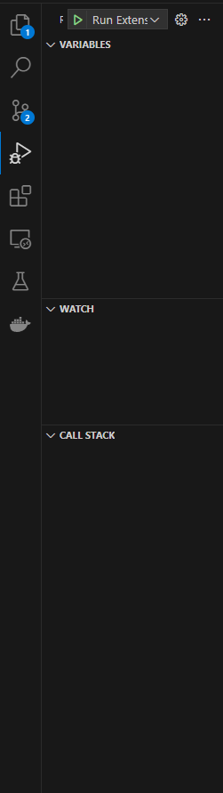
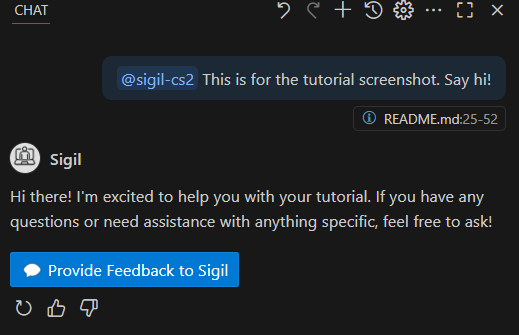

# SIGIL-PS

SIGIL-PS, Stepwise Instructional Guide for Independently Learning Programming Skills (or just "Sigil") is an LLM-based conversational agent for VS Code intended for novice programming students (for example, NAU's CS 136 course). It implements guards to coach, model, and scaffold computational thinking skills.

## Install (end users)

You can use SIGIL-PS in two ways:

1. **From the VS Code Marketplace (recommended)**  
   - Open VS Code.
   - Go to the **Extensions** view (`Ctrl+Shift+X` / `Cmd+Shift+X`).
   - Search for **"SIGIL-PS"** (publisher: `RESHAPELab`) and install it.
2. **From a `.vsix` package**  
   - Download the desired `.vsix` from the GitHub **Releases** page for this repository.
   - In VS Code, open the **Extensions** view, click the `...` menu, choose **Install from VSIX...**, and pick the downloaded file.  
   - For more detail, see `install_instructions.md`.

## Features

### Standalone chat in the sidebar

This extension adds a **Sigil** view to the activity bar (the left sidebar). Open it by clicking the Sigil icon, then use the chat panel there—no need to open VS Code’s Chat view or type `@sigil-ps`. The extension talks to the **Sigil backend** (see the [sigil-ps-core](../sigil-ps-core) repo) and works independently of GitHub Copilot.

### File context

Sigil automatically includes context from your files:

1. **Current file** – The extension includes the content of the file you are editing. If you have a selection, only that portion is included; otherwise the whole file is included.
2. **Additional files** – You can attach more files in the Sigil chat panel (file attachment or drag-and-drop). They are sent as context to the backend.

## Backend URL (configuration)

The extension does **not** use a `config.ts` or `config.template.ts` file. The backend URL is determined at runtime in [src/apiConfig.ts](src/apiConfig.ts):

- **Production** – Uses the default production API URL (e.g. Azure-hosted).
- **Test** – If the setting `sigil.developerSettings.test` is `true`, it uses a test API URL.
- **Local backend** – When in test mode, if `sigil.developerSettings.apiUrl` is set (e.g. `http://localhost:80` or `http://localhost:5000`), that URL is used instead of the default test URL.

So to point the extension at your **local** Sigil API: enable **Sigil: Developer Settings: Test** and set **Sigil: Developer Settings: Api Url** to your API base (e.g. `http://localhost:80`).

## Requirements

- [VS Code](https://code.visualstudio.com/download) (version **1.93** or newer; see `engines.vscode` in package.json)
- [Node.js](https://nodejs.org/) with npm/npx

## For developers

### Setup

From the extension repo root:

```bash
npm install
```

### Running and debugging

1. Open this project in VS Code.
2. Open the **Run and Debug** view (`Ctrl+Shift+D` / `Cmd+Shift+D`).
3. Select **Run Extension** and press **F5** (or click the play button).

A new VS Code window opens with the extension loaded. In that window:

- Open the **Sigil** chat from the activity bar (left sidebar): click the Sigil icon to show the Sigil view, then use the chat panel. No need to open the Chat view or type `@sigil-ps`.





### Using a local backend

1. Start the Sigil API locally (e.g. via [sigil-ps-core](../sigil-ps-core) Docker or Flask).
2. In the **Extension Development Host** window (or in your normal VS Code if you installed the extension): open Settings and set:
   - **Sigil: Developer Settings: Test** – enable.
   - **Sigil: Developer Settings: Api Url** – your API base URL (e.g. `http://localhost:80` or `http://localhost:5000`).
3. Open the Sigil panel from the sidebar and use it; requests will go to your local API.

### Project structure

| Path | Description |
|------|-------------|
| `src/extension.ts` | Extension entry point; registers commands and the chat view. |
| `src/chatViewProvider.ts` | Provides the Sigil chat view (webview). |
| `src/chatPanel.ts` | Chat panel / webview setup. |
| `src/webviewMessageHandler.ts` | Handles messages between webview and extension (e.g. send message, feedback). |
| `src/apiConfig.ts` | Resolves backend URL from VS Code settings (prod/test/custom). |
| `src/auth.ts` | Authentication (e.g. GitHub) for the backend. |
| `src/personalization.ts` | Personalization API calls. |
| `media/` | Built webview assets (e.g. from sigil-ps-core UI) served to the webview. |

### Testing

**Manual testing:** Run the extension (F5), open the Sigil chat from the activity bar sidebar, and use the panel. Optionally use a local backend (see above).

**Automated tests:** The project is set up for **Extension Tests** (launch config "Extension Tests" and `npm run test`), but the **test suite is not yet implemented** — there is currently no `src/test/` folder and no test files. To add tests later:

1. Create a test suite (e.g. `src/test/suite/index.ts`) and test files matching `**/*.test.ts` under `src/test/`.
2. Use `@vscode/test-electron` to run tests in a VS Code extension host.
3. Run via the **Extension Tests** launch config or fix `package.json`’s `test` script to point at your test runner (e.g. the compiled `out/test/runTest.js` or equivalent).

See [VS Code Extension Testing](https://code.visualstudio.com/api/working-with-extensions/testing-extension) for details.

### Building and packaging

- **Compile:** `npm run compile` (TypeScript → `out/`).
- **Package:** `npm run package` (produces a `.vsix` via `vsce package`). Output is typically in the project root or a `builds/` folder (e.g. `sigil-ps-0.4.0.vsix`).

### Install for end users

To install a built `.vsix` (e.g. for testing or distribution), see [install_instructions.md](install_instructions.md).

## Extension settings

| Setting | Description |
|---------|-------------|
| `sigil.persona` | Persona Sigil uses (default: "Default"). |
| `sigil.personalizeResponses` | Use feedback to personalize responses. |
| `sigil.personalizedPrompt` | Extra preferences for responses. |
| `sigil.fieldStudyOptIn` | Consent to anonymous use of interactions in RESHAPE Lab publications. |
| `sigil.developerSettings.test` | Use test backend (and optional custom URL). |
| `sigil.developerSettings.apiUrl` | Custom API base URL when test mode is on (e.g. `http://localhost:80`). |

## Known issues

- The automated test suite is not yet implemented (see **Testing** above).

## Release notes

- **v1.1.0** – Current version (see `package.json`), published to the VS Code Marketplace.
- Earlier versions – See the GitHub **Releases** page for tags, notes, and downloadable `.vsix` packages.

## Extension guidelines

Follow the [Extension Guidelines](https://code.visualstudio.com/api/references/extension-guidelines) and best practices when developing this extension.

## Continuous delivery and GitHub releases

This repository is configured so that **merging a pull request into the default branch** automatically creates (or reuses) a GitHub Release based on the version in `package.json`:

- When a PR is merged into the default branch, the GitHub Action:
  - Reads the current extension version from `package.json` (e.g. `1.1.0`).
  - Uses the tag `v<version>` (e.g. `v1.1.0`) for the release.
  - Creates a new GitHub Release if one with that tag does not already exist, or skips if it does.
- To cut a new release, **bump the version in `package.json`** in the PR you are merging; after the merge, the workflow will publish a corresponding GitHub Release and tag.
